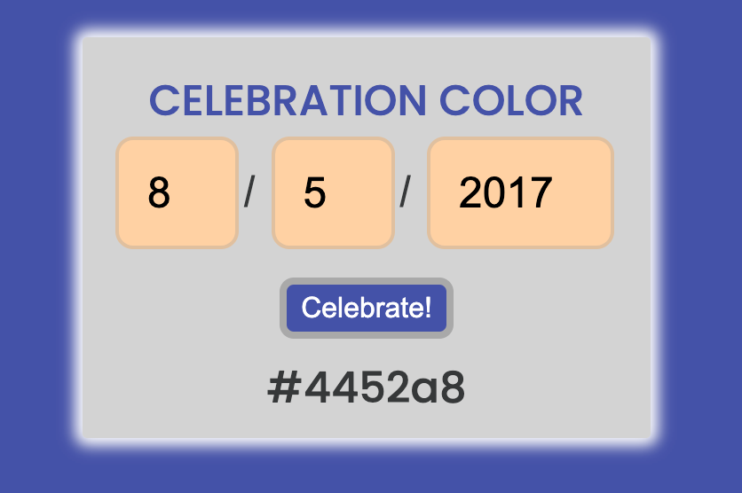

# True Color

This project was made for a coding challenge to create a horoscope. In dedication to those who do not know their exact birth dates, or wish not to celebrate that date, I created the application dedicated to producing a hex color based on the user's chosen date. Whether that date be their birthday or otherwise is up to their discretion. Hopefully it becomes one of their favored colors.

## Current Hosting

To see deployed site, visit [The Calculator here](https://jpmbvistro-true-color.netlify.app)
See my other deployed projects there as well!

## Work With Me

If you would like to work with me, feel free to contact me through [my website](https://www.jpmbvistro.com), my [LinkedIn](https://www.linkedin.com/in/juan-justin-vistro/), or email me directly [jpmbvistro@gmail.com](mailto:JPMBVistro@gmail.com)

## Screenshots

### Contributions
At this moment, I am currently not accepting contributions for this project.
